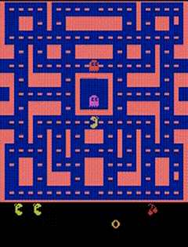

# pacman-dqn

`pacman-dqn` is a reinforcement learning project build around a complete Ms. Pac-Man training environment. It uses 
Gymnasium and Arcade Learning Environment (ALE) to interact with the game environment, and includes
TensorFlow-based implementation of Deep Q-Network (DQN) and Double DQN (DDQN) for agent training and evaluation. Below is
a short gameplay clip of the trained agent in action.

<div align="center">
    
</div>

## Customizing the agent

This project is modular and allows you to easily expand upon existing solutions and run custom experiments. Primary logic
for agent training is located in `agents/base.py`. You can inherit from the `TrainableAgent` class and override its 
methods to implement custom training behaviors, alternative reward strategies, or advanced DQN-based variations.

## Configuration and hyperparameters

All training configuration and hyperparameters are defined in `core/settings.py` file. This allows you to easily adjust
parameters like learning rates, epsilon decay, or batch sizes without modifying the core execution logic.

Additionally, project provides automated data management throughout the training cycle &ndash; it cyclically (based on
the configuration value) saved the model at specified intervals, exports raw data necessary for plotting, and logs
the exact configuration parameters to guarantee the reproducibility of your experiments.

## Workflow management

The entire lifecycle of the agent, from training and evaluation to plotting and workspace cleanup, is managed via
dedicated command-line interface (CLI). When installed, the package exposes the `pacman-agent` command globally (or
within your virtual environment) to easily execute all available workflows.

### Training and evaluation

Command in this group cover the core reinforcement learning loop. They allow you to initiate a new training session from
scratch or validate the performance of previously saved model directly in the Atari emulator.

```text
train
    Train the Ms. Pac-Man agent.
-o, --output DIRECTORY
    Output directory for training results (logs, mode and data for plots).
--agent STRING
    Type of agent to train (dqn, ddqn).
    
validate
    Run the agent in the Atari environment.
--agent STRING
    Type of agent to validate (dqn, ddqn, random).
--model-path FILE
    Trained DQN agent (.h5 extension) file path. Not required for random agent.
--episodes INTEGER
    Number of episodes to record during validation.
```

### Plotting and cleanup

Once your experiments are running or completed, use these utilities to visualize the agent's learning process and manage
your workspace by securely removing outdated logs and model checkpoints.

```text
plot
    Plot training results from the specified file(s).
--data-path PATH
    Training results data file(s) (.jsonl extension).
--avg-window INTEGER
    Moving average window size for learning curve.
-o, --output DIRECTORY
    Output directory for plots.
    
cleanup
    Clean up training results in the specified output path older than given duration.
--duration STRING
    Duration for cleaning up old training results (eg. 1m, 1h30m, etc.).
-o, --output DIRECTORY
    Output directory for training results (logs, model and data for plots).
```
